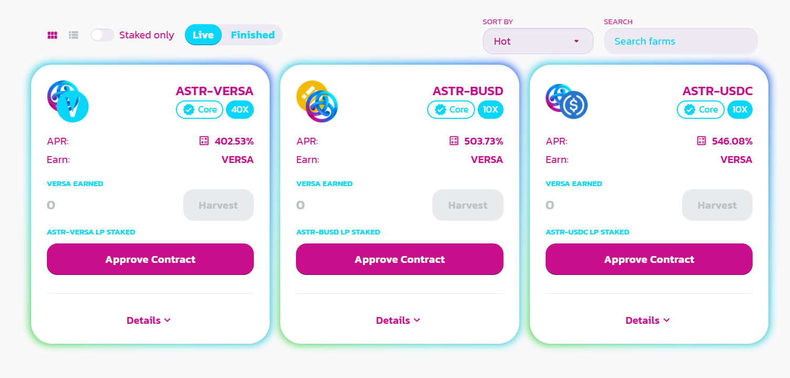

# 💸 Farm

The Farm is the place to stake your LP tokens (which you can get by providing [Liquidity](broken-reference)) and earn VERSA as a reward.

## Supported pairs

* ASTR-VERSA
* ASTR-BUSD
* ASTR-USDC

## Farming

So how do you farm? It's very easy:

1. Select a pair you want to farm

2\. Get some LP tokens by [providing liquidity](broken-reference) for the pair you selected.

3\. Earn VERSA!
